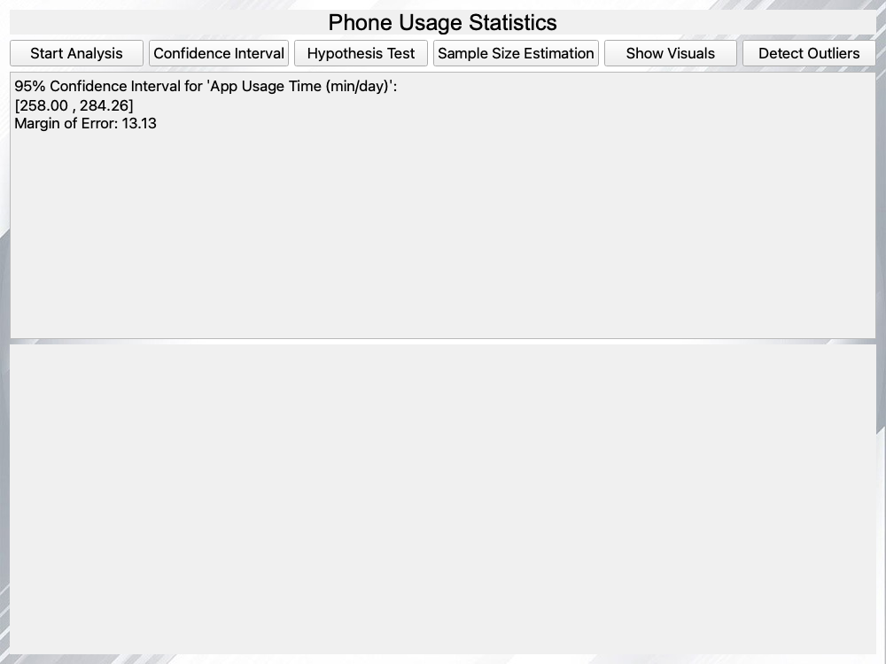
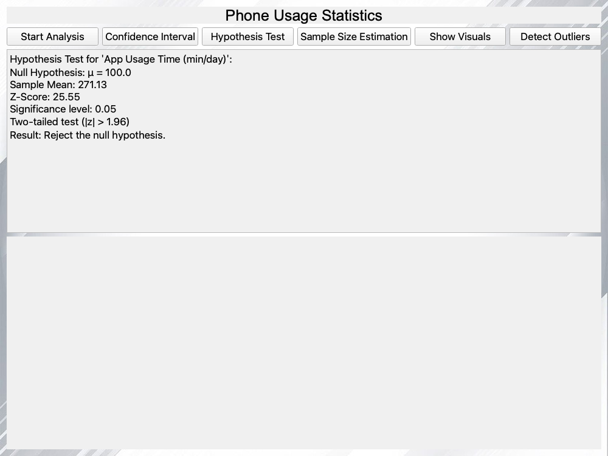

# 📱 Phone Usage Statistics Dashboard

**A PyQt5 desktop dashboard for descriptive statistics, confidence intervals, z-tests and IQR outlier detection on a 700-user phone-usage dataset, with every statistic implemented by hand (no pandas, NumPy or SciPy).**

<p>
  
  
  
</p>

Author: Saed O S Radi

---

## Overview

The app loads [`user_behavior_dataset.csv`](user_behavior_dataset.csv), which describes 700 smartphone users: device model, OS, app usage time, screen-on time, battery drain, number of apps, data usage, age, gender and a usage class from 1 to 5. Each button runs one statistical analysis on the **App Usage Time (min/day)** column and prints the result in the window. At startup the app also renders a histogram and box plot of that column, shown by **Show Visuals**.

<p align="center"></p>

## Analyses

| Button | What it computes |
|---|---|
| **Start Analysis** | Count, mean, median, sample variance (n − 1), standard deviation and standard error |
| **Confidence Interval** | 95% confidence interval for the mean: mean ± 1.96 × SE, plus the margin of error |
| **Hypothesis Test** | Two-tailed one-sample **z-test** of H₀: μ = 100 at α = 0.05 (reject if \|z\| > 1.96) |
| **Sample Size Estimation** | Required sample size n = ⌈(z·σ / E)²⌉ for 95% confidence |
| **Detect Outliers** | Q1, Q3 and IQR (linear-interpolation percentiles), bounds Q1 − 1.5·IQR and Q3 + 1.5·IQR, and the number of points outside them |
| **Show Visuals** | Histogram (20 bins) and box plot of the column, drawn with matplotlib |

### Implemented by hand

All the statistics (mean, median, variance, standard deviation, standard error, percentiles, confidence interval, z-score and sample size) are written from first principles in plain Python, using only the standard-library `csv` and `math` modules. The project uses **no pandas, NumPy or SciPy**; matplotlib is used only to draw the charts.

The results were cross-checked against Python's built-in `statistics` module (`mean`, `median`, `variance`, `stdev`, `quantiles(method="inclusive")`) and match exactly:

| Statistic | Value (App Usage Time, min/day) |
|---|---|
| Count | 700 |
| Mean / Median | 271.13 / 227.50 |
| Variance / Std. deviation / Std. error | 31,399.66 / 177.20 / 6.70 |
| 95% CI | [258.00, 284.26] (margin 13.13) |
| z vs μ₀ = 100 | 25.55 → reject H₀ |
| Q1 / Q3 / IQR | 113.25 / 434.25 / 321.00 → 0 outliers |

## Screenshots

*Captured from the running app (off-screen) after pressing each button.*

| Startup | Confidence interval |
|:---:|:---:|
|  |  |

| Hypothesis test | Sample size estimation |
|:---:|:---:|
|  |  |

| Outlier detection | Visuals |
|:---:|:---:|
|  |  |

## Tech Stack

| Area | Tools |
|---|---|
| Language | Python 3 |
| GUI | PyQt5 (Qt Widgets) |
| Charts | matplotlib |
| Statistics | Hand-written, using the `math` and `csv` standard-library modules |

## Project Structure

```
.
├── main.py                     # Entry point: creates the QApplication and main window
├── gui_main.py                 # MainWindow: UI, CSV loading, all statistics and charts
├── user_behavior_dataset.csv   # Dataset (Apache 2.0, see Dataset below)
├── DATASET_LICENSE.txt         # Apache License 2.0 text for the dataset
├── x.jpeg                      # Window background image
├── screenshots/
└── requirements.txt
```

## How to Run

```bash
python -m venv venv
source venv/bin/activate
pip install -r requirements.txt
python main.py
```

Run it from the project folder: the dataset and background image are loaded by relative path, and the chart is written to `Visualization.png` in the same folder on every start.

## Dataset

**[Mobile Device Usage and User Behavior Dataset](https://www.kaggle.com/datasets/valakhorasani/mobile-device-usage-and-user-behavior-dataset)** by **Vala Khorasani** on Kaggle, used unmodified and redistributed under the **[Apache License 2.0](https://www.apache.org/licenses/LICENSE-2.0)** (full text in [`DATASET_LICENSE.txt`](DATASET_LICENSE.txt)).

Its author notes that the dataset "was primarily designed to implement machine learning algorithms and is not a reliable source for a paper or article", so the results here are a statistics exercise, not findings about real phone users.

## Known Limitations

- **Only one column is analysed.** Every analysis is fixed to *App Usage Time (min/day)*; there's no way to pick another column or load a different file from the GUI.
- **Hard-coded hypothesis-test mean.** The z-test always uses H₀: μ = **100**. With a sample mean of about 271, it always rejects H₀, so the test isn't meaningful for this data.
- **Hard-coded sample-size inputs.** Sample Size Estimation uses a fixed σ = **50** and margin of error E = **5** instead of the data's own standard deviation (about 177), so it always reports **385**.
- **z instead of t.** The confidence interval and hypothesis test use the normal critical value 1.96 rather than a t-distribution. That's a close approximation at n = 700, but it isn't stated in the app.
- **Charts are generated at startup.** The histogram and box plot are written to `Visualization.png` when the app opens; **Show Visuals** only displays that file.
