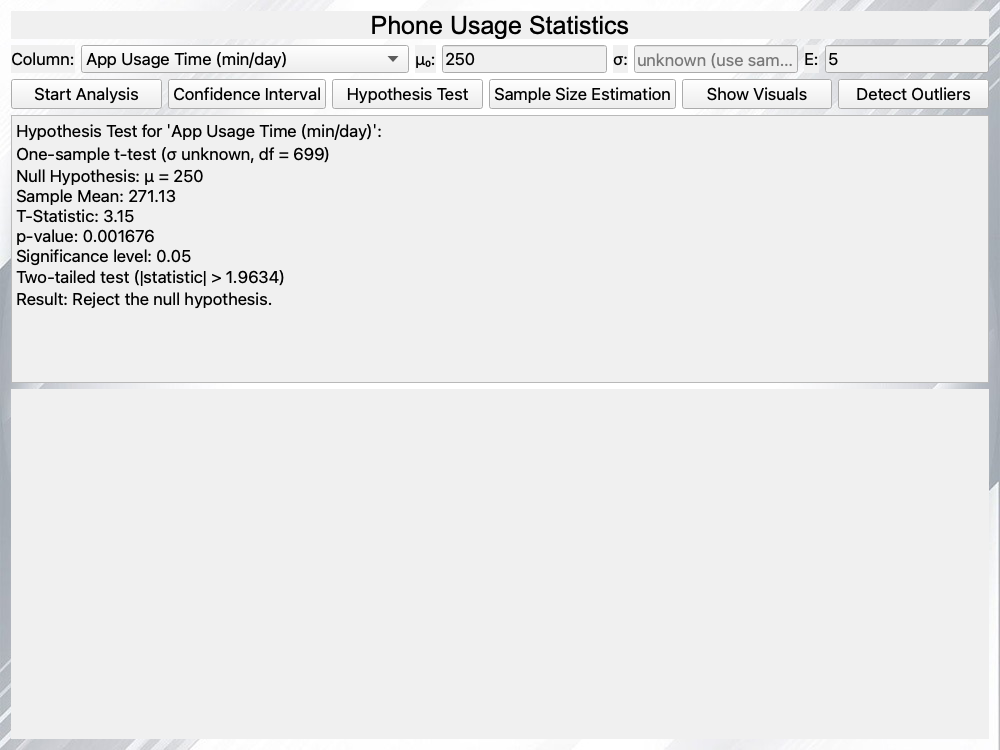
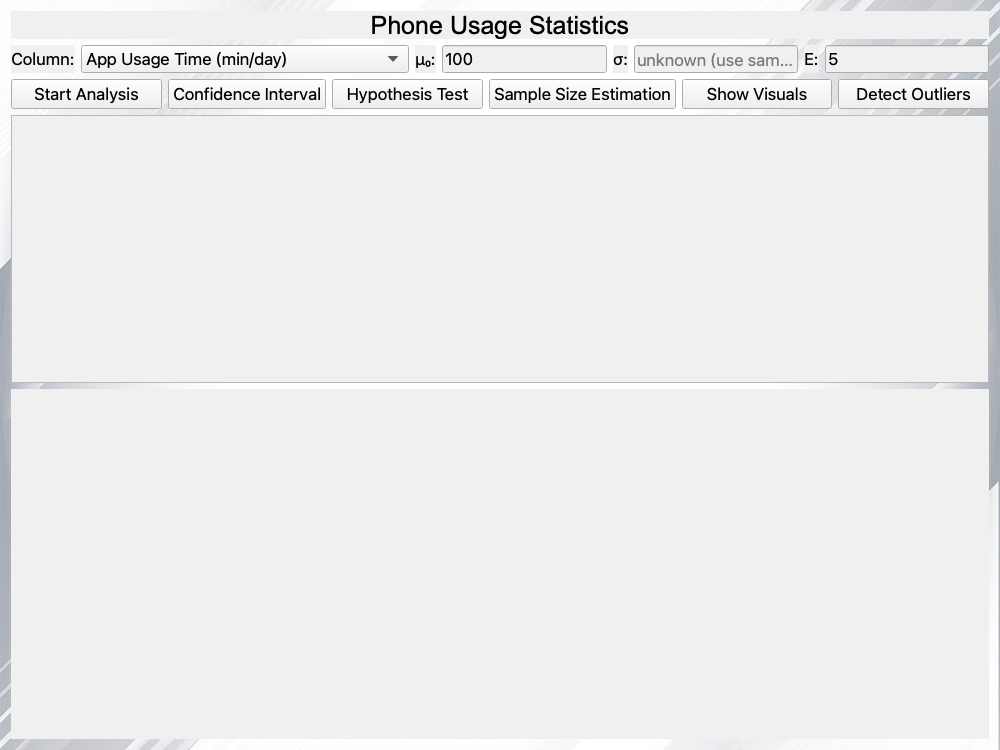
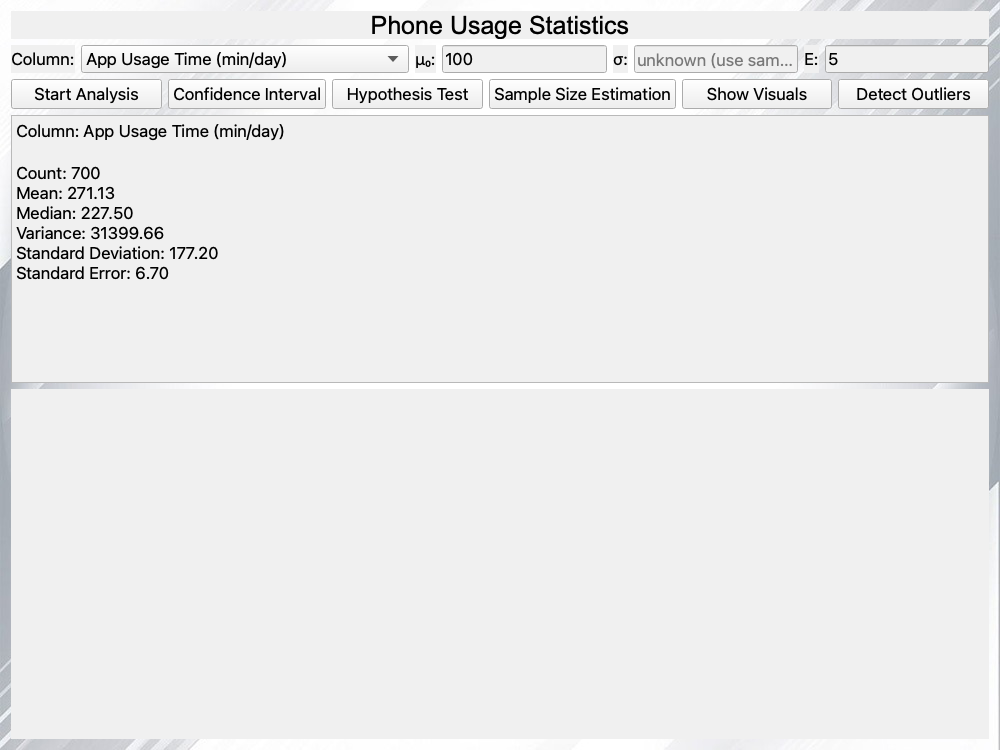
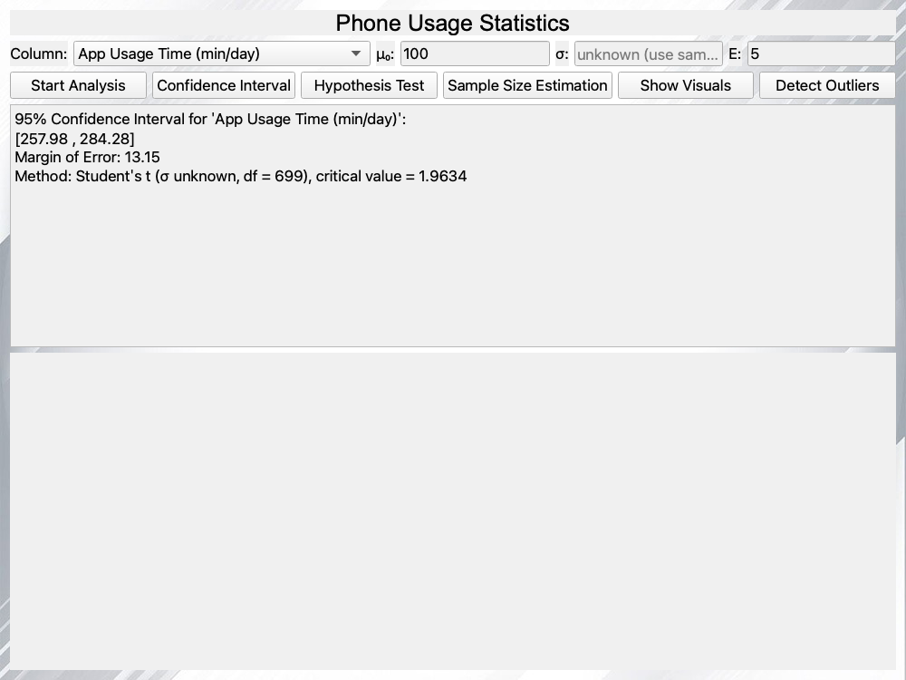
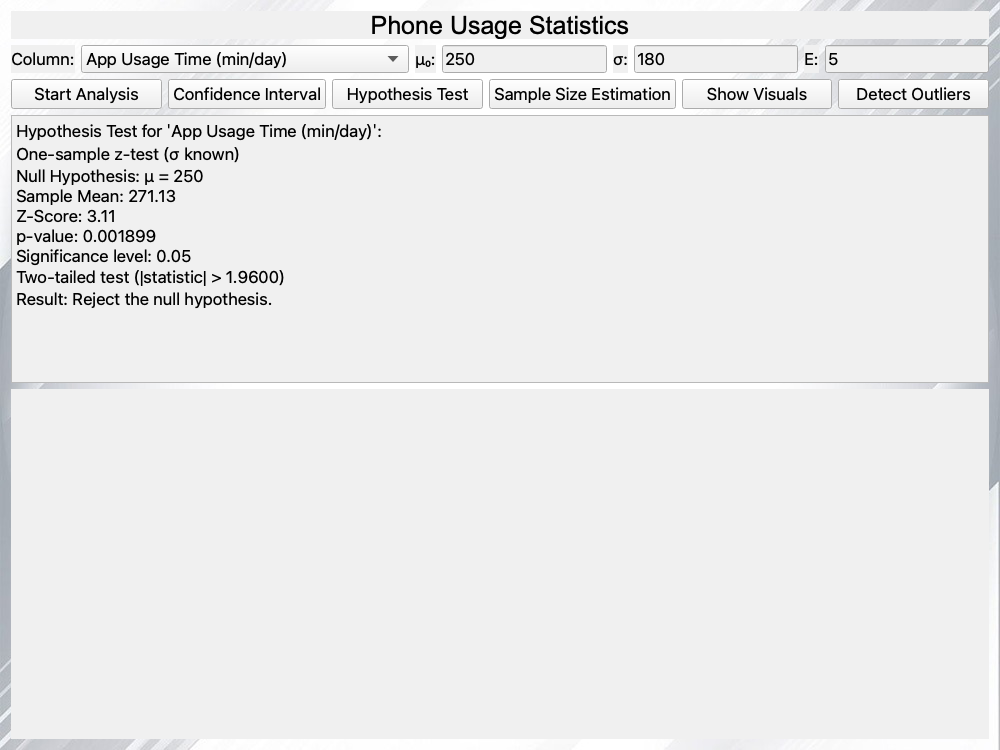
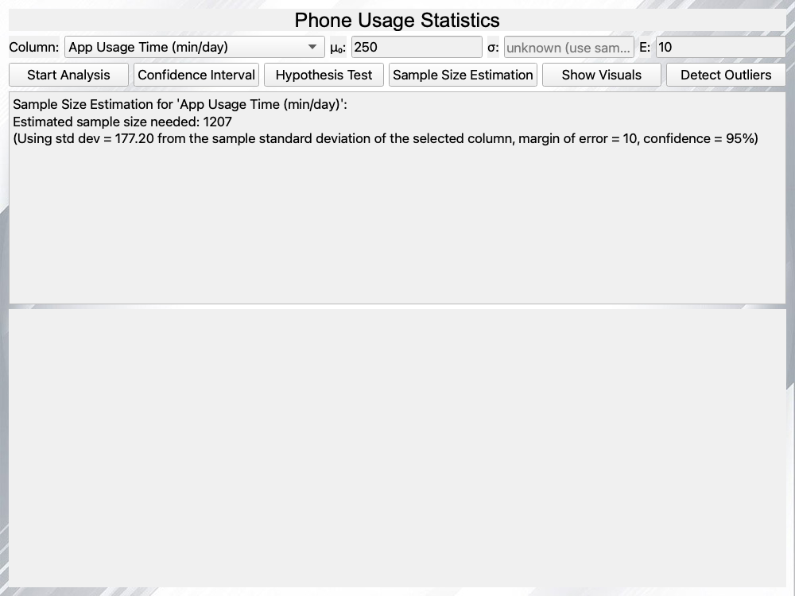
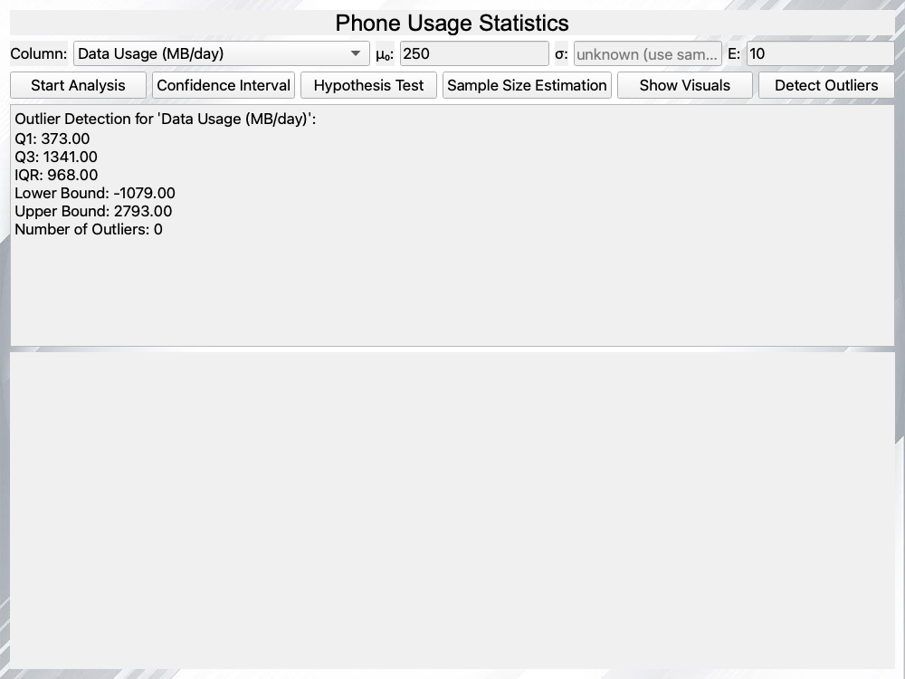
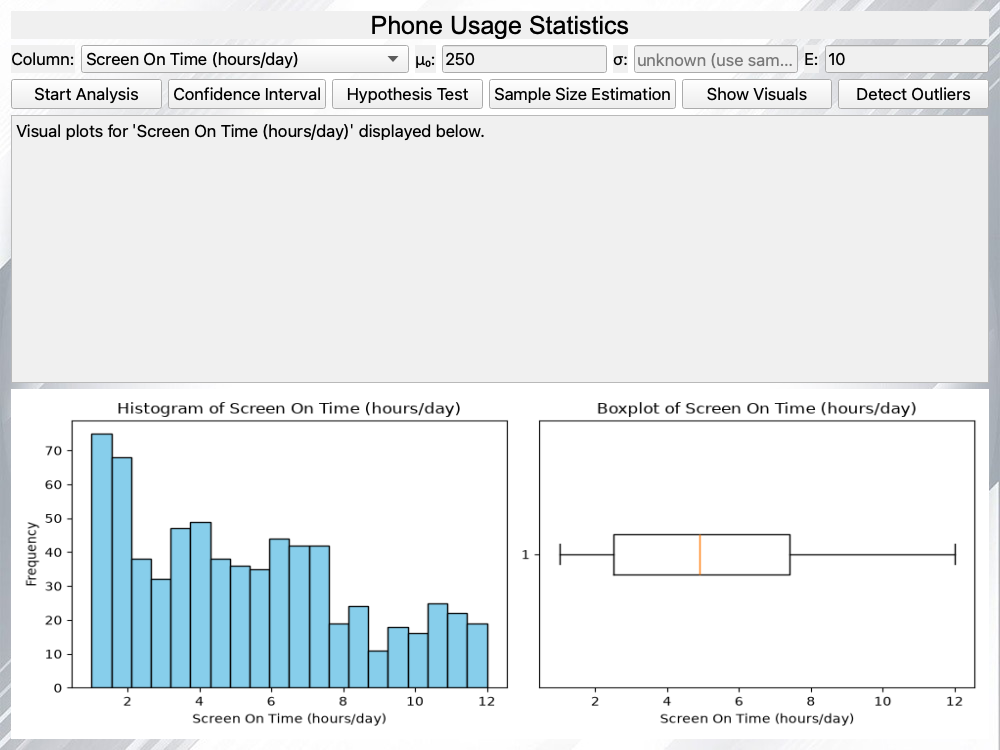

# 📱 Phone Usage Statistics Dashboard

**A PyQt5 desktop dashboard for descriptive statistics, confidence intervals, t/z hypothesis tests, sample-size estimation and IQR outlier detection on a 700-user phone-usage dataset. Every statistic, including the Student's t distribution, is implemented by hand (no pandas, NumPy or SciPy).**

<p>
  
  
  
</p>

Author: Saed O S Radi

---

## Overview

The app loads [`user_behavior_dataset.csv`](user_behavior_dataset.csv), which describes 700 smartphone users: device model, OS, app usage time, screen-on time, battery drain, number of apps, data usage, age, gender and a usage class from 1 to 5.

Pick any **numeric column** from the dropdown, optionally set the test and planning parameters, and press a button. Every analysis and chart follows the selected column.

<p align="center"></p>

### Inputs

| Field | Meaning | Used by |
|---|---|---|
| **Column** | Any numeric column: App Usage Time, Screen On Time, Battery Drain, Number of Apps Installed, Data Usage, Age, User Behavior Class | All analyses and charts |
| **μ₀** | Hypothesised population mean (default 100) | Hypothesis Test |
| **σ** | Known population standard deviation. **Leave empty if unknown** | Confidence Interval, Hypothesis Test, Sample Size |
| **E** | Desired margin of error (default 5) | Sample Size Estimation |

Invalid input (text, an empty μ₀, σ ≤ 0, E ≤ 0) is rejected with a message.

## Analyses

| Button | What it computes |
|---|---|
| **Start Analysis** | Count, mean, median, sample variance (n − 1), standard deviation and standard error |
| **Confidence Interval** | 95% CI for the mean. **σ empty → Student's t** with df = n − 1: x̄ ± t* · s/√n. **σ given → z**: x̄ ± z* · σ/√n. Shows the method and critical value |
| **Hypothesis Test** | Two-tailed test of H₀: μ = μ₀ at α = 0.05. **σ empty → one-sample t-test**, **σ given → z-test**. Reports the statistic, **p-value**, critical value and decision |
| **Sample Size Estimation** | n = ⌈(z* · σ / E)²⌉ at 95% confidence, using the entered σ, or the column's sample standard deviation as a planning estimate when σ is empty |
| **Detect Outliers** | Q1, Q3 and IQR (linear-interpolation percentiles), bounds Q1 − 1.5·IQR and Q3 + 1.5·IQR, and the points outside them |
| **Show Visuals** | Histogram (20 bins) and box plot of the selected column, drawn with matplotlib |

### Implemented by hand

All statistics live in [`stats_tools.py`](stats_tools.py), written from first principles with only the standard-library `math` module. The project uses **no pandas, NumPy or SciPy**; matplotlib is used only to draw the charts.

- **Descriptive statistics:** mean, median, sample variance and standard deviation, and percentiles by linear interpolation.
- **Normal distribution:** CDF from `math.erf`; the critical value z* is found by bisection.
- **Student's t distribution:** CDF via the **regularized incomplete beta function**, evaluated with a continued fraction (modified Lentz's method) and `math.lgamma`. The critical value t* for any degrees of freedom is found by bisection, and p-values come from the CDF. No lookup table is needed.

### Verification

- **Critical values:** the hand-written t critical values match standard t tables to 4 decimals for df = 1, 2, 3, 5, 10, 20, 30, 60, 100 and 120 (e.g. t*₀.₉₇₅ = 12.7062 for df = 1 and 2.2281 for df = 10). z* = 1.959964 and the normal p-values match Python's `statistics.NormalDist` exactly.
- **The real GUI was tested off-screen** on all 7 numeric columns, pressing every button in both t mode (σ empty) and z mode (σ given). Its results were compared with Python's `statistics` module (`mean`, `median`, `variance`, `stdev`, `quantiles(method="inclusive")`, `NormalDist`): **137/137 checks passed**, including the input-validation cases.

Example (App Usage Time, min/day, n = 700):

| Statistic | Value |
|---|---|
| Mean / Median | 271.13 / 227.50 |
| Std. deviation / Std. error | 177.20 / 6.70 |
| 95% CI, t-based (σ unknown, t* = 1.9634) | [257.98, 284.28] |
| t-test of H₀: μ = 250 | t = 3.15, p = 0.0017 → reject H₀ |
| z-test of H₀: μ = 250 with σ = 180 | z = 3.11, p = 0.0019 → reject H₀ |
| Sample size for E = 10 (σ from the data) | 1,207 |

## Screenshots

*Captured from the running app (off-screen).*

| Startup | Descriptive statistics |
|:---:|:---:|
|  |  |

| Confidence interval (t, σ unknown) | Hypothesis test (z, σ = 180) |
|:---:|:---:|
|  |  |

| Sample size (E = 10) | Outliers (Data Usage) |
|:---:|:---:|
|  |  |

| Visuals (Screen On Time) |
|:---:|
|  |

## Tech Stack

| Area | Tools |
|---|---|
| Language | Python 3 |
| GUI | PyQt5 (Qt Widgets) |
| Charts | matplotlib (rendered in memory) |
| Statistics | Hand-written in `stats_tools.py`, using the `math` and `csv` standard-library modules |

## Project Structure

```
.
├── main.py                     # Entry point: creates the QApplication and main window
├── gui_main.py                 # MainWindow: UI, CSV loading, analyses and charts
├── stats_tools.py              # Hand-written statistics: descriptive stats, normal and t distributions
├── user_behavior_dataset.csv   # Dataset (Apache 2.0, see Dataset below)
├── DATASET_LICENSE.txt         # Apache License 2.0 text for the dataset
├── x.jpeg                      # Window background image
├── screenshots/
└── requirements.txt
```

## How to Run

```bash
python -m venv venv
source venv/bin/activate
pip install -r requirements.txt
python main.py
```

Run it from the project folder: the dataset and background image are loaded by relative path.

## Dataset

**[Mobile Device Usage and User Behavior Dataset](https://www.kaggle.com/datasets/valakhorasani/mobile-device-usage-and-user-behavior-dataset)** by **Vala Khorasani** on Kaggle, used unmodified and redistributed under the **[Apache License 2.0](https://www.apache.org/licenses/LICENSE-2.0)** (full text in [`DATASET_LICENSE.txt`](DATASET_LICENSE.txt)).

Its author notes that the dataset "was primarily designed to implement machine learning algorithms and is not a reliable source for a paper or article", so the results here are a statistics exercise, not findings about real phone users.

## Improvements

Changes made after the original course version:

- **Any numeric column.** A dropdown selects the column; every analysis and both charts follow the selection. Previously everything was fixed to *App Usage Time*.
- **User-entered parameters.** μ₀, σ and E are now input fields, replacing the hard-coded μ₀ = 100, σ = 50 and E = 5. Sample size now uses the entered σ, or the data's own standard deviation when σ is unknown.
- **t-based inference when σ is unknown.** The confidence interval and hypothesis test use Student's t with n − 1 degrees of freedom unless σ is given, in which case they use z. Critical values and the new **p-values** are computed by hand (incomplete beta function + bisection), so the result no longer depends on the fixed constant 1.96.
- **Charts on demand.** The histogram and box plot are drawn in memory for the selected column when **Show Visuals** is pressed, instead of being written to `Visualization.png` at startup.
- **Statistics moved to `stats_tools.py`** as small pure functions, so they can be tested without the GUI.

## Known Limitations

- **Fixed 95% confidence.** The confidence level and α = 0.05 are constants in `gui_main.py`, not GUI options.
- **Fixed dataset.** The app always loads `user_behavior_dataset.csv`; there's no option to open another file.
- **No outliers in this dataset.** No numeric column has values outside the 1.5·IQR bounds, so **Detect Outliers** always reports 0 here. The method works, but the data doesn't exercise it.
